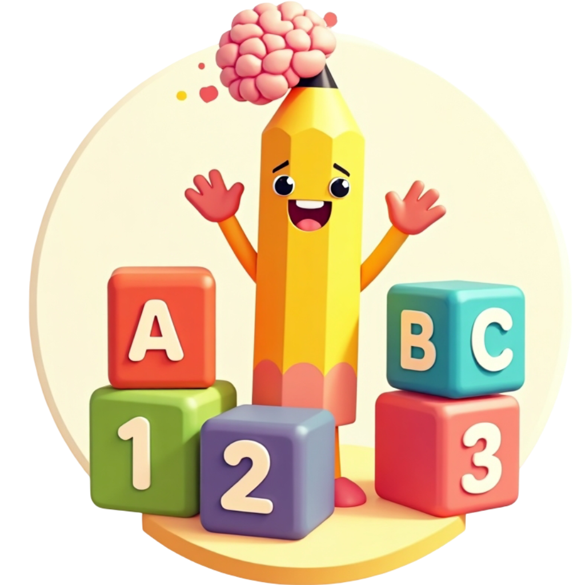

# 🎨 ABC123 - Çocuklar İçin Eğitici Çizim Uygulaması

<div align="center">
  
  
  [](https://flutter.dev/)
  [](https://dart.dev/)
  [](https://www.tensorflow.org/lite)
  [](LICENSE)
</div>

## 📱 Uygulama Hakkında

ABC123, çocukların rakam, harf ve şekil öğrenimini eğlenceli bir şekilde destekleyen interaktif bir Flutter uygulamasıdır. TensorFlow Lite makine öğrenmesi teknolojisi kullanarak çocukların çizdikleri rakam, harf ve şekilleri tanır ve doğru çizim konusunda rehberlik eder.

## ✨ Özellikler

### 🎯 Ana Özellikler
- **Rakam Tanıma**: 0-9 arası rakamları çizip tanıma
- **Harf Tanıma**: A-Z arası harfleri çizip tanıma
- **Sıralı Çizim Rehberi**: Doğru çizim sırasını gösteren animasyonlu rehber
- **Çoklu Dil Desteği**: Türkçe ve İngilizce dil seçenekleri
- **Sesli Geri Bildirim**: Başarı ve hata durumları için ses efektleri
- **Renkli Çizim Araçları**: 7 farklı renk seçeneği
- **Temizleme Özelliği**: Çizimi silme ve yeniden başlama

### 🎨 Kullanıcı Arayüzü
- **Modern Tasarım**: Çocuk dostu renkli ve eğlenceli arayüz
- **Responsive Tasarım**: Farklı ekran boyutlarına uyumlu
- **Kolay Navigasyon**: Sezgisel alt navigasyon menüsü
- **Tutorial Sistemi**: Uygulama kullanımı için rehber

### 🤖 Teknik Özellikler
- **TensorFlow Lite**: Yerel makine öğrenmesi modeli
- **EMNIST Dataset**: Gelişmiş harf tanıma algoritması
- **Custom Neural Network**: Özel eğitilmiş rakam tanıma modeli
- **Offline Çalışma**: İnternet bağlantısı gerektirmez

## 🚀 Kurulum

### Gereksinimler
- Flutter SDK (>=3.13.0)
- Dart SDK (>=3.1.0)
- Android Studio / VS Code
- Android SDK / Xcode (mobil geliştirme için)

### Adım Adım Kurulum

1. **Repository'yi klonlayın**
   ```bash
   git clone https://github.com/cengizhankkaya/abc123.git
   cd abc123
   ```

2. **Bağımlılıkları yükleyin**
   ```bash
   flutter pub get
   ```

3. **Uygulamayı çalıştırın**
   ```bash
   flutter run
   ```

## 📁 Proje Yapısı

```
lib/
├── core/                    # Temel yapılandırma ve yardımcı sınıflar
│   ├── constants/          # Uygulama sabitleri
│   ├── services/           # Servis sınıfları
│   ├── theme/              # Tema yapılandırması
│   └── utils/              # Yardımcı fonksiyonlar
├── features/               # Özellik bazlı modüller
│   ├── draw/              # Çizim ekranı ve işlevleri
│   ├── home/              # Ana ekran ve navigasyon
│   ├── info/              # Bilgi ve sonuç ekranları
│   └── letters/           # Harf çizim özellikleri
├── shared/                # Paylaşılan widget'lar ve provider'lar
└── main.dart              # Uygulama giriş noktası
```

## 🎮 Kullanım

### Ana Ekran
- **Rakam Çizimi**: Sol menüden rakam çizim moduna geçin
- **Harf Çizimi**: Sağ menüden harf çizim moduna geçin
- **Tutorial**: Uygulama kullanımını öğrenmek için tutorial'ı izleyin

### Çizim Ekranı
1. **Renk Seçimi**: Sağ panelden istediğiniz rengi seçin
2. **Çizim**: Ekrana dokunarak rakam veya harf çizin
3. **Tanıma**: "Tanı" butonuna basarak sonucu görün
4. **Temizleme**: "Temizle" butonu ile çizimi silin

### Sıralı Çizim Rehberi
- Çizim sırasını öğrenmek için animasyonlu rehberi takip edin
- Her adımda doğru çizim yönünü gösteren oklar
- Sesli geri bildirim ile doğru/yanlış çizim uyarıları

## 🛠️ Teknoloji Stack

### Frontend
- **Flutter**: Cross-platform UI framework
- **Dart**: Programlama dili
- **Provider**: State management
- **Material Design**: UI/UX tasarım sistemi

### Machine Learning
- **TensorFlow Lite**: Yerel ML modeli
- **EMNIST Dataset**: Harf tanıma için
- **Custom CNN Model**: Rakam tanıma için

### Diğer Teknolojiler
- **Google Mobile Ads**: Reklam entegrasyonu
- **Audio Players**: Ses efektleri
- **Shared Preferences**: Yerel veri saklama
- **Image Processing**: Çizim işleme

## 📊 Model Performansı

| Model | Doğruluk | Boyut | Kullanım Alanı |
|-------|----------|-------|----------------|
| Rakam Modeli | %95+ | ~2MB | 0-9 rakam tanıma |
| Harf Modeli | %90+ | ~5MB | A-Z harf tanıma |
| Kombine Model | %92+ | ~7MB | Genel tanıma |

## 🎯 Hedef Kitle

- **3-8 yaş arası çocuklar**
- **Ebeveynler ve öğretmenler**
- **Eğitim kurumları**
- **Özel eğitim merkezleri**

## 🔧 Geliştirme

### Yeni Özellik Ekleme
1. `lib/features/` altında yeni modül oluşturun
2. Provider pattern kullanarak state management yapın
3. Responsive tasarım prensiplerini uygulayın
4. Test yazın ve dokümantasyon ekleyin

### Model Güncelleme
1. Yeni TensorFlow Lite modelini `assets/models/` klasörüne ekleyin
2. `pubspec.yaml` dosyasında asset path'ini güncelleyin
3. Model yükleme kodunu güncelleyin
4. Test edin ve performansı ölçün

## 📱 Desteklenen Platformlar

- ✅ **Android** (API 21+)
- ✅ **iOS** (iOS 11+)
- ✅ **Web** (Chrome, Firefox, Safari)
- ✅ **Desktop** (Windows, macOS, Linux)

## 🤝 Katkıda Bulunma

1. Fork yapın
2. Feature branch oluşturun (`git checkout -b feature/amazing-feature`)
3. Commit yapın (`git commit -m 'Add amazing feature'`)
4. Push yapın (`git push origin feature/amazing-feature`)
5. Pull Request oluşturun

## 📄 Lisans

Bu proje MIT lisansı altında lisanslanmıştır. Detaylar için [LICENSE](LICENSE) dosyasına bakın.

## 👨‍💻 Geliştirici

**Cengizhan Kaya**
- GitHub: [@cengizhankkaya](https://github.com/cengizhankkaya)
- Email: [İletişim için GitHub profilini ziyaret edin]

## 🙏 Teşekkürler

- [Flutter Team](https://flutter.dev/) - Harika framework için
- [TensorFlow Team](https://www.tensorflow.org/) - ML desteği için
- [EMNIST Dataset](https://www.nist.gov/itl/products-and-services/emnist-dataset) - Harf veri seti için
- Tüm katkıda bulunan geliştiriciler

## 📞 İletişim

Sorularınız, önerileriniz veya hata raporları için:
- GitHub Issues kullanın
- Pull Request gönderin
- Geliştirici ile iletişime geçin

---

<div align="center">
  <p>⭐ Bu projeyi beğendiyseniz yıldız vermeyi unutmayın!</p>
  <p>Made with ❤️ and Flutter</p>
</div>